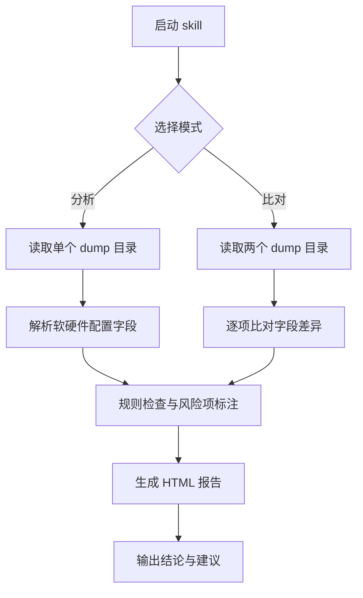

# ascend-dump-analyzer（昇腾 NPU 环境信息采集与分析）

采集、分析、比对昇腾 NPU 服务器环境信息（dump），用于部署前环境体检、多环境一致性核查与故障排查前的环境基线确认。

## 应用场景

- 部署训练/推理前，批量体检客户环境的软硬件配置（NPU 型号/驱动/CANN/固件/OS 等）。
- 怀疑环境差异导致问题时，对比两台/多台机器（如好机 vs 坏机）的配置漂移。
- 故障排查第一步：确认现场环境是否符合软件配套要求。
- 定期巡检集群环境，归档环境基线。

## 解决什么问题

- 现场环境信息零散、版本多，人工逐条收集慢且易漏：本 skill 提供零依赖采集脚本，一键生成结构化 dump。
- dump JSON 字段庞大难读：自动解析为人类可读的结构化分析结论。
- 两套环境"哪里不一样"难定位：自动逐项比对并高亮差异项（配置漂移检测）。

## 需要什么输入（如何获取）

| 输入 | 说明 | 获取方式 |
|------|------|----------|
| dump 目录 / dump JSON | 机器环境信息的结构化采集结果 | 在目标服务器上运行本 skill 自带的 `msprechecker_dump.py`（纯 Python 标准库、零依赖），即可在当前目录生成 dump JSON；将整个 dump 目录下载/拷贝到分析机即可 |
| 第二个 dump 目录（可选） | 比对模式所需的对照环境 dump | 用同一脚本在另一台机器上采集一份即可 |

无需安装任何额外依赖；若已有历史 dump 文件，直接提供路径即可。

## 输出成果

- 分析模式：终端结构化结论 + HTML 分析报告（软硬件清单、版本配套检查结果、风险项提示）。
- 比对模式：逐项差异清单（相同项/差异项/仅一方存在项），并以 HTML 报告呈现，便于粘贴到问题单或汇报材料。

## 流程图



## 使用样例提示词

```text
# 分析模式
使用 ascend-dump-analyzer 分析 D:\dumps\hostA\ 目录下的 dump 信息

# 现场采集（在目标服务器上）
用 ascend-dump-analyzer 的采集脚本在这台服务器上收集环境 dump

# 比对模式
用 ascend-dump-analyzer 对比 D:\dumps\good\ 和 D:\dumps\bad\ 两个 dump 的配置差异
```
