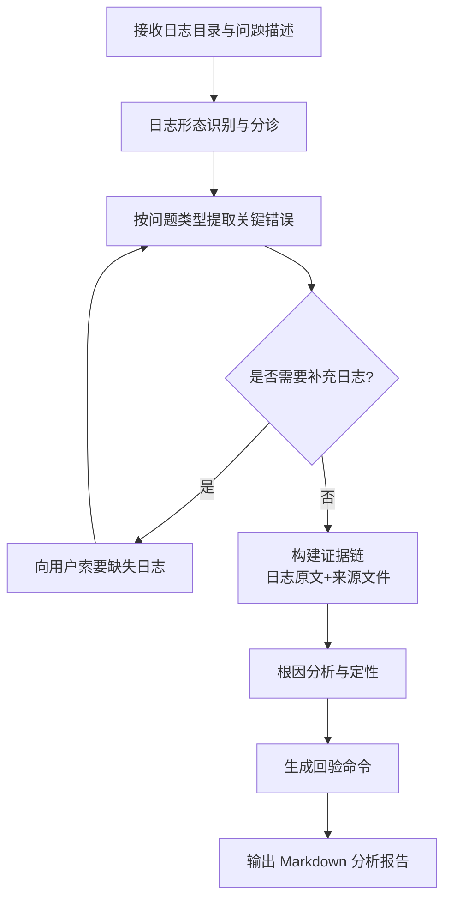

# ascend-field-issue-analyzer（现网问题日志取证分析）

面向现网昇腾 NPU 问题的文本日志取证分析技能，从 plog/slog/host/device/framework 等原始日志中构建证据链，定位训练/推理中断、算子报错、环境异常的根因。

## 应用场景

- 现场（现网）报告训练/推理任务异常中断、hang、报错，需要从日志定性问题。
- 客户仅提供一键收集的日志包，需要快速给出初步结论与证据。
- 需要区分"环境问题 / 软件缺陷 / 误用"时做日志取证。
- 对疑难问题做回验：给出可复现、可验证的排查命令。

## 解决什么问题

- 日志量大、类型杂（plog、slog、host、device、framework、dmesg），人工翻找效率低：自动按问题类型分诊并提取关键错误。
- 结论缺乏证据支撑：强制证据链（日志原文 + 文件 + 行号），杜绝"凭感觉下结论"。
- 只给结论不给验证路径：每条结论附带回验命令，客户可自行确认。

## 需要什么输入（如何获取）

| 输入 | 说明 | 获取方式 |
|------|------|----------|
| 现网日志目录/日志包 | 包含 plog、slog、host 日志、device 日志、framework 日志、dmesg 等 | 现场通过昇腾一键收集工具（如 `msnpureport` 或硬件的一键日志收集功能）打包导出；解包后把日志目录路径提供给 skill |
| 问题描述（可选） | 现象、时间点、任务名 | 由用户口述或工单内容提供，可显著提升定位效率 |

不强制依赖特定工具；只要能提供日志文本文件即可分析。

## 输出成果

- Markdown 格式的分析报告：问题定性、证据链（含日志原文摘录与来源文件）、根因分析、回验步骤、建议措施。
- 中间产物：关键错误摘要、时间线梳理（由 `log_analyzer.py` 辅助提取）。

## 流程图



## 使用样例提示词

```text
# 基础分析
使用 ascend-field-issue-analyzer 分析 D:\logs\case123 目录下的一键收集日志，
任务是训练中断，时间点大约在 14:30

# 指定现象
用 ascend-field-issue-analyzer 取证 D:\logs\20250801\，现象：8 卡训练在 step 1200 左右 hang 住，
请给出证据链和回验命令
```

## 四条铁律（内置约束）

1. 不臆测：所有结论必须有日志证据。
2. 不遗漏：关键错误必须逐条给出处置建议。
3. 可回验：结论必须附验证命令。
4. 不越界：只做日志取证定性，不替代正式缺陷单。
