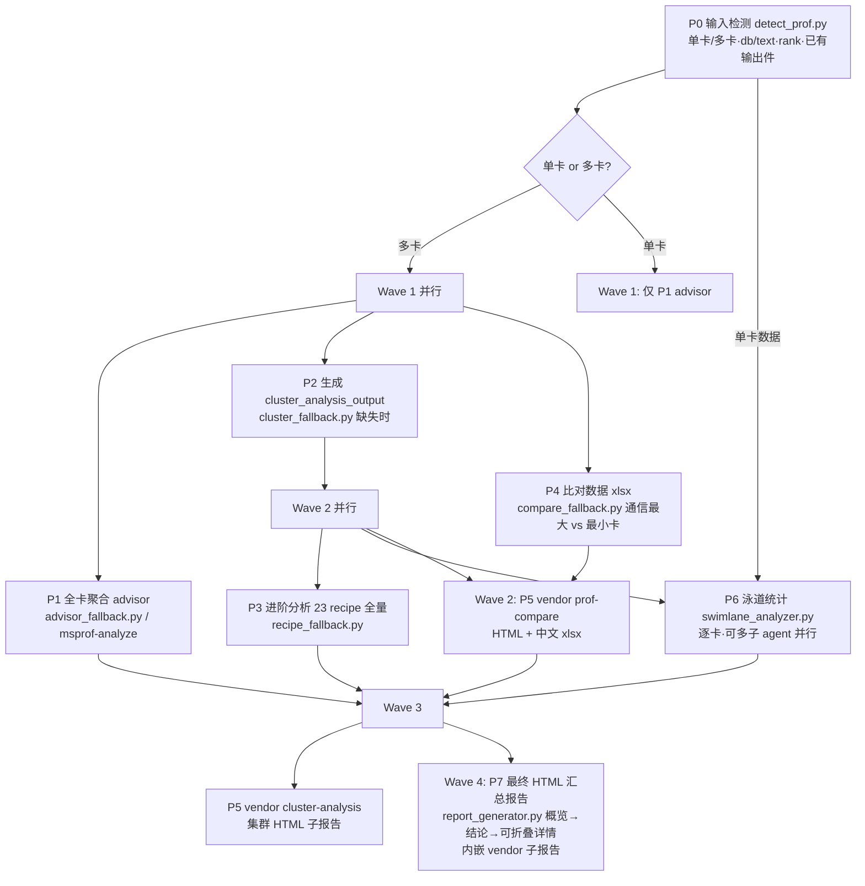

# cluster-analysis（昇腾 NPU 训练性能比对分析）

面向昇腾 NPU 训练场景的一站式性能分析技能：自动识别 Prof 采集数据形态（单卡/多卡、db/text 格式、框架），串联专家建议（advisor）、集群分析输出件、23 个进阶 recipe、慢卡比对与泳道算子统计，最终产出一份含左侧导航、可折叠分区、子报告内嵌的完整交互式 HTML 诊断报告。兼容 msprof-analyze 开源项目全部能力——已安装则优先调用原生 CLI，未安装则使用内置 fallback 脚本（能力等价）。

## 应用场景

- 单卡训练性能瓶颈定位：想知道一次训练任务到底慢在计算、通信还是 Host 下发。
- 多卡/集群慢卡排查：某张卡或某个 rank 拖慢整体，需要定位慢卡并找出原因。
- 通信问题分析：HCCL 算子耗时、通信带宽、通信矩阵、PP 流水线气泡、快慢 rank 相互等待。
- MoE 大模型专项：专家负载均衡（ep_load_balance）、MFU 计算、AI Core 频率异常识别。
- Host 侧下发瓶颈：CANN API 汇总、Device 侧大块空闲时间归因（free_analysis）。
- 出正式报告：训练/推理性能调优后需要一份可直接汇报的 HTML/MD 性能分析报告。
- 数据已有 `cluster_analysis_output`：直接复用并做进阶分析与报告生成，不重复解析。

## 解决什么问题

- **不知道从哪分析起**：输入检测（P0）自动识别数据形态并给出建议步骤清单，随后全量执行五大类 23 个 recipe，不遗漏任何维度。
- **msprof-analyze 未安装/版本不匹配**：内置 fallback 脚本与原生 CLI 能力等价，零环境依赖即可跑通全流程。
- **多卡数据量庞大、逐卡分析太慢**：按"波次（Wave）"调度并行子 agent，advisor/集群输出件/泳道统计多路并行，泳道分析逐卡拆分，trace_view.json（数百 MB）用流式解析。
- **分析结论碎片化**：所有中间产物（advisor、recipe CSV、比对 xlsx、泳道 md、vendor 子报告）统一汇总进最终 HTML 报告，信息概览在前、结论建议随后、详情可折叠展开。
- **对比对象选择困难**：多卡时自动选取**通信占比最大**与**最小**的两张卡做性能比对，直击快慢卡差异。

## 需要什么输入（如何获取）

| 输入 | 说明 | 获取方式 |
|------|------|----------|
| Prof 采集数据目录（必需） | 单卡为一个卡目录，多卡为包含多个卡目录的数据根目录 | 见下方三种采集方式 |
| `cluster_analysis_output`（可选） | 已有的集群分析输出件（db + 8 张基表） | 之前用 msprof-analyze cluster 或本技能生成过则放在数据根目录下自动复用 |
| 基准数据（可选） | 标杆性能数据，用于 cluster_time_compare_summary 对比 | 历史基线任务的 cluster 分析输出件（`--bp` 场景） |

数据根目录结构示例（多卡）：

```
<数据根目录>/
├── PROF_001001_20250101120000_123456/      # 卡目录：PROF_ 前缀，或任意直接包含
│   └── ASCEND_PROFILER_OUTPUT/             #   ASCEND_PROFILER_OUTPUT 的目录
│       ├── ascend_pytorch_profiler_0.db    # PyTorch db 格式（文件名含 rank 号）
│       │   或 ascend_mindspore_profiler_0.db    # MindSpore db 格式
│       │   或 mindstudio_insight_data.db        # MindStudio Insight db
│       ├── api_statistic.csv               # text-CSV 格式（与 db 二选一也可共存）
│       ├── step_trace_time.csv
│       └── trace_view.json                 # text-JSON（Chrome Trace），泳道统计首选数据源
├── PROF_001002_20250101120001_234567/      # 卡 1 …（rank 号从 db 文件名自动识别）
└── cluster_analysis_output/                # 可选：已有则复用，缺失则自动生成
```

三种采集方式：

1. **torch_npu / mindspore Profiler API 采集**（最常用）：训练脚本中开启 `torch_npu.profiler.profile(...)` 或 MindSpore Profiler，跑完若干 step 后在输出目录得到 `PROF_*` 卡目录。
2. **msprof 命令行采集**：`msprof --application=... --output=<dir>`，产物同样为 `PROF_*` 目录结构。
3. **现网/他人提供的数据**：拿到训练侧打包的 prof 目录后，只要保证"数据根目录下是若干卡目录、卡目录内含 `ASCEND_PROFILER_OUTPUT`"即可直接使用；db 与 text 格式混装也能识别（但 PyTorch 与 MindSpore 混装会告警）。

> 原始数据全程**只读**；所有产物写到数据根目录下的 `cluster_analysis_mw/` 与 `cluster_analysis_output/`，不污染原始采集件。

## 输出成果

全部中间件与最终交付集中在一个目录（run_workflow 默认 `cluster_analysis_mw/`，各脚本可用 `--output` 自定义）：

```
<数据根目录>/
├── cluster_analysis_output/                # 多卡且缺失时生成（P2）
│   ├── cluster_analysis.db                 # 8 张基表（耗时/通信/带宽/矩阵/映射…）
│   ├── recipes/<recipe_name>/*.csv         # 23 个注册 recipe + 1 个扩展 recipe 输出（P3）
│   └── recipes_summary.md / .json          # 五大类归类汇总
└── cluster_analysis_mw/
    ├── detect_result.json                  # P0：模式、rank→目录映射、建议步骤
    ├── advisor/advisor.md + .json          # P1：全卡聚合专家建议（计算/通信/调度占比与优先级）
    ├── compare/                            # P4：performance_comparison_result_{max}_{min}.xlsx、CSV 镜像
    ├── reports/                            # P5：cluster_analysis_report.html、
    │                                       #   compare_analysis_report.html、chinese_xlsx/
    ├── swimlane/                           # P6：swimlane_rank<N>.md/.json（逐卡）、swimlane_compare.md（跨卡）
    └── performance_report.html             # P7：最终 HTML 报告（iframe 内嵌 vendor 子报告）
```

核心交付物解读：

- **advisor.md**：总体判定（计算/通信/调度占比与主导因素）+ 按优先级排序的调优建议，多卡为全卡聚合视角。
- **23 个注册 recipe 结果**：拆解对比类（迭代耗时拆解、module 层级、NPU/GPU 校准）、计算类（算子汇总、频率、MoE 负载、MFU）、通信类（通信域/耗时/矩阵/带宽、HCCL TopN、PP 流水图、慢卡/慢链路归因）、Host 下发类（CANN API、空闲分析）、其他（导出/MSTX/P2P 配对）；另有扩展 recipe `communication_bandwidth_sum` 随全量执行、产出 csv，不计入五大类矩阵。
- **泳道统计**：按 Thread/Stream/Communication（非 Plane）泳道输出最长算子 + 全部算子七列表（ms），多卡跨卡比对；最终报告按 Process/Ascend Hardware/Communication 三类汇总。
- **慢卡比对**：通信占比最大 vs 最小两张卡的整体指标/算子/通信/内存/API 多维对比，vendor 产出 HTML + 中文 xlsx。
- **最终 HTML 报告**：信息概览 → 结论与建议 → 可折叠详情分区（默认全展开）→ vendor 子报告内嵌；集群总览按 Step 区分并附计算/通信/free 三部分 × Step 差异柱状图。

## 流程图



并行调度要点：每波最多 3 个子 agent；P6 泳道统计逐卡独立、是最佳并行点；P3 依赖 P2 的集群输出件；P7 必须等 P1~P6 全部完成。也可用 `scripts/run_workflow.py` 一键串行编排（调试/兜底），各阶段支持 `--skip-*` 与 `--force`。

## 使用样例提示词

完整分析（单卡或多卡均适用）：

```text
使用 cluster-analysis 分析这个训练性能数据目录：D:\prof_data\llama3_8p
请自动识别输入形态，执行完整分析流程（advisor、集群分析、全部 recipe、
通信占比最大/最小卡比对、泳道算子统计），最后生成完整 HTML 报告，
并给出 top 3 性能瓶颈与调优建议。
```

只看专家建议，快速定位主导因素：

```text
用 cluster-analysis 对 D:\prof_data\single_card 做一次 advisor 诊断，
只需告诉我这次训练是计算瓶颈还是通信瓶颈，以及优先级最高的 3 条建议。
```

指定两张卡做对比：

```text
用 cluster-analysis 对比 D:\prof_data\16p 中的 rank 0 和 rank 11，
生成比对报告（HTML + 中文 xlsx），重点解释通信差异来源。
```

只做泳道算子统计：

```text
用 cluster-analysis 对 D:\prof_data\8p 做泳道算子统计，
输出每张卡的 Thread/Stream/Communication 泳道最长算子表，
并做跨卡比对，找出耗时最异常的 rank。
```

一键脚本直跑（不经过 agent 调度）：

```text
在 D:\prof_data\8p 目录直接运行 cluster-analysis 的 run_workflow.py
做全流程分析，跳过泳道统计，输出目录用默认的 cluster_analysis_mw。
```

## 参考文档与约束

- `references/pipeline.md` — P0~P7 各阶段输入/输出/验收标准、全局纪律、并行波次调度与 vendor 调用方式（唯一事实来源，必读）
- `references/recipes_catalog.md` — 23 个 recipe 五大类完整目录
- `references/msprof_cli.md` — msprof-analyze 原生 CLI 与 fallback 能力对照
- `references/html_template_spec.md` — 最终 HTML 报告模板规范（可折叠、ECharts 懒初始化等）

约束提示：db 内时间为 μs、text-CSV 为 μs、text-JSON 为 ms，报告统一换算 ms 并标注；泳道分类不含 Plane 泳道；单个 recipe 数据缺失只标注"不支持/数据缺失"，不中断整体流程；advisor 原生 CLI 产出文件仅供留档，归一化 advisor.md/json 始终由 fallback 生成。
