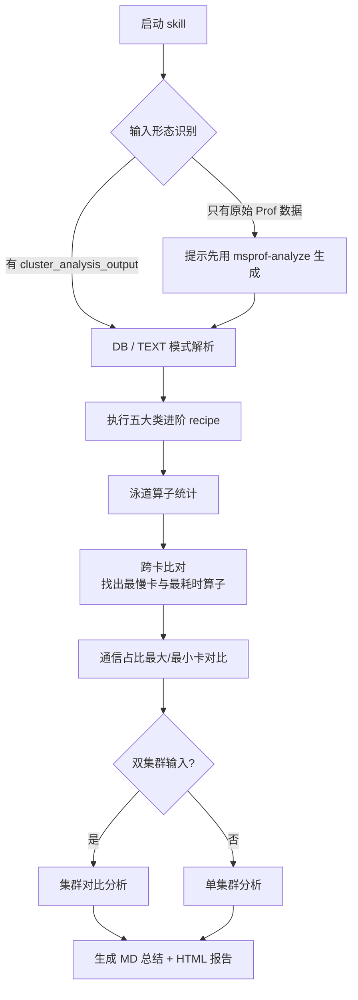

# cluster-analysis（昇腾集群 Profiling 分析）

对单卡或多卡/集群的 Prof 数据进行性能分析、瓶颈定位、慢卡/慢算子排查与通信问题分析，并生成包含导航、折叠分区与子报告的完整 HTML 报告。

## 应用场景

- 集群训练/推理性能不达标，需要定位瓶颈（计算、通信、调度）。
- 多卡任务中出现慢卡（掉队者），需要跨卡比对找出异常 rank/节点。
- 已有 `cluster_analysis_output` 目录（DB 或 TEXT 形态），需要一键出报告。
- 需要对比两个集群（或两轮数据）的性能差异。

## 解决什么问题

- Prof 数据维度多（算子、通信、调度、内存），人工逐个分析耗时：自动执行五大类进阶 recipe 全量分析。
- 集群规模大时"慢卡"难找：泳道算子统计 + 跨卡比对，自动排出最慢卡与最耗时算子。
- 通信问题定位难：自动统计各卡通信占比，对比通信占比最大/最小卡，输出通信瓶颈结论。
- 报告难沉淀：生成左侧固定导航、可折叠分区、子报告嵌入的 HTML 报告，便于归档与汇报。

## 需要什么输入（如何获取）

| 输入 | 说明 | 获取方式 |
|------|------|----------|
| `cluster_analysis_output` 目录 | 集群分析数据（DB 模式为 SQLite 集群库，TEXT 模式为文本汇总） | 若现场已有则直接提供路径；若只有原始 Prof 数据，先用 `msprof-analyze` 对 Prof 目录执行集群分析生成该目录（本 skill 会在缺失时提示生成） |
| 第二个 `cluster_analysis_output` 目录（可选） | 双集群比对所需 | 用同样方式对另一组 Prof 数据生成一份 |

支持 DB 与 TEXT 两种数据形态，skill 会自动识别输入形态。

## 输出成果

- Markdown 总结：关键结论、TOP 瓶颈、慢卡清单、通信占比结论。
- HTML 报告：左侧固定导航 + 可折叠分区 + 子报告嵌入的完整性能分析报告（单集群分析或双集群比对）。
- 中间统计：泳道算子统计表、跨卡（最大/最小）比对结果。

## 流程图



## 使用样例提示词

```text
# 单集群分析
使用 cluster-analysis 分析 D:\prof\cluster_analysis_output 目录（TEXT 模式），
输出性能分析与瓶颈定位 HTML 报告

# 双集群比对
用 cluster-analysis 对比 D:\prof\run1 和 D:\prof\run2 两个集群数据，
找出性能差异原因并生成比对报告

# 慢卡排查
用 cluster-analysis 分析 D:\prof\case1，重点排查慢卡和通信瓶颈
```
