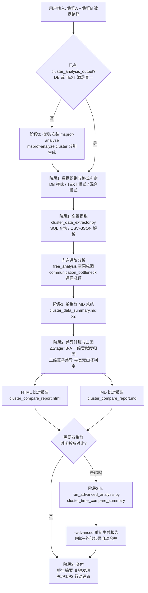

# cluster-compare（昇腾集群比对分析）

昇腾（Ascend）集群性能比对工具：**比对两个集群的 profiling 数据**，定位性能差异并输出劣化归因 HTML / MD 双格式报告。若用户没有现成的集群分析结果，可先用 `msprof-analyze cluster` 从原始采集数据生成，再执行比对。

---

## 一、应用场景

| 场景 | 说明 |
|---|---|
| 正常集群 vs 异常集群 | 集群训练突然变慢，用同结构正常集群作基准（A），异常集群作对比（B），定位劣化根因 |
| 调优前后对比 | 修改并行策略、通信优化、组网调整后，验证集群级收益或回退 |
| 环境差异排查 | 不同机房、网络组网、驱动/CANN 版本下的集群性能差异归因 |

**不适用**：单集群整体分析、单卡分析、GPU/NPU 单机双目录比对（单机/单卡场景请使用 prof-compare）。

## 二、可以解决什么问题

- 两个集群 Stage 总耗时差多少？劣化幅度多大？
- 劣化来自**计算、通信还是空闲**？（贡献度归因，带 1% 显著性门控，避免 ΔStage 趋近 0 时贡献度爆炸）
- 哪些**通信算子**差异最大？（通信算子差异 Top10 表格 + 柱状图）
- **带宽下降**是真实链路劣化还是统计口径差异？（均值带宽 + 有效吞吐双口径判定：均值降而吞吐平 → 口径差异；均值与吞吐同降 → 真实劣化）
- **慢卡**在哪？（Rank 级差异热力图，Stage 时间偏离均值 > 10% 标记异常）
- **空闲时间**成因是什么？（free_analysis 进阶分析：Reason 分布、次数、总时长、占比）
- **通信瓶颈**在哪张卡、哪个算子？（communication_bottleneck 进阶分析：慢/快 Rank 耗时差与推断原因）
- 双集群 rank/step 级时间指标对比与 Top 差异 Rank（cluster_time_compare_summary，仅 DB 模式）

所有报告全中文输出，含「分析与判断」和「综合判断（基准 vs 对比）」，并给出 P0/P1/P2 优先级行动建议。

## 三、输入要求

### 3.1 数据形态（三选一，集群 A、B 各一份）

| 模式 | 必备文件 | 位置 |
|---|---|---|
| DB 模式（旧格式） | `cluster.db` | 数据目录根下 |
| DB 模式（新格式） | `cluster_analysis.db` | `cluster_analysis_output/` 子目录内 |
| TEXT 模式 | `cluster_step_trace_time.csv` + `communication_group.json` | 数据目录下或 `cluster_analysis_output/` 子目录内 |

同时存在 DB 和 TEXT 时优先使用 DB。附带文件（有则更全，无则该项分析标空）：`cluster_communication.json`（通信算子耗时）、`cluster_communication_matrix.json`（通信矩阵）。

### 3.2 输入文件夹如何获取

**方式一：现成的集群分析结果（推荐）**

如果已经跑过集群分析（或在集群性能平台上下载过结果），直接提供两个集群的数据目录即可。目录内应有上述 DB 或 TEXT 文件。

**方式二：从原始采集数据生成（阶段 0 自动完成）**

如果手上只有原始 profiling 采集数据（同一次采集的多张卡目录，如 `dp0_pp0_tp0_..._rank0_..._ascend_pt/`，全部放在同一个父目录下），本 skill 会自动：

1. 检测/安装 msprof-analyze（`pip install msprof-analyze`，要求 Python 3.7.5+，建议 3.9+）
2. 对两个集群分别执行：

```bash
msprof-analyze cluster -m all -d <profiling_path> -o <output_path>
```

生成 `cluster_analysis_output/`（TEXT：`cluster_step_trace_time.csv`、`communication_group.json` 等；DB：`cluster_analysis.db`）。

**采集前置条件**（影响数据完整性，需在训练采集时满足）：

- `profiler_level` 需为 **Level1 及以上**，否则无通信小算子数据，仅能汇总 step_trace_time（通信带宽/矩阵缺失）
- `-d` 目录内必须是**同一次采集**的多张卡子目录，不要混入不同批次或缺失 rank，否则通信矩阵映射可能不准确
- 昇腾950PR&950DT 系列 CCU 场景不支持采集通信矩阵和通信算子带宽数据，此类数据缺失属正常现象

### 3.3 关键约定

- 集群 **A 为基准（正常）**，集群 **B 为对比（异常）**，所有差值 = B − A
- 原始数据单位为微秒（μs），报告展示时自动转换为毫秒（ms）
- TEXT 模式 JSON 中时间单位为 ms，DB 模式为 μs，脚本自动适配

## 四、可以得到什么输出

| 输出件 | 文件名 | 说明 |
|---|---|---|
| HTML 比对报告 | `cluster_compare_report.html` | ECharts 交互式图表：KPI 卡片、Step 耗时对比柱状图、负载类型双饼图、劣化归因瀑布图、通信算子差异 Top10、带宽对比、Rank 级差异热力图、根因总结与行动建议、进阶分析章节 |
| MD 比对报告 | `cluster_compare_report.md` | 与 HTML 同口径的八章节中文报告：综合结论 / 核心指标对比 / 劣化根因 / 行动建议 / Step 级耗时对比 / Rank 级差异 / 通信算子差异 / 进阶分析 |
| 单集群 MD 总结 | `{data_dir}/cluster_data_summary.md` | 每个集群一份：集群概览、Step 时间统计、Rank 级明细、负载分布、通信分析、异常 Rank 识别、数据完整性说明 |
| 进阶分析 JSON（可选） | `advanced_analysis.json` | 双集群时间拆解对比（cluster_time_compare_summary），可 `--advanced` 合并进 HTML/MD 报告 |

未指定输出路径时，比对报告默认保存在集群 A 的数据目录下。

## 五、流程图



## 六、脚本一览

| 脚本 | 作用 |
|---|---|
| `scripts/cluster_data_extractor.py` | 自动识别 DB/TEXT 格式，提取全景数据为 JSON，默认内嵌执行进阶分析（`--no-advanced` 可跳过） |
| `scripts/generate_cluster_report.py` | 生成 HTML 比对报告（自动合并内嵌与外部进阶分析） |
| `scripts/generate_cluster_md.py` | 生成 MD 比对报告（与 HTML 同口径，`--top-ranks` 控制 Rank 级差异表行数） |
| `scripts/run_advanced_analysis.py` | 进阶分析编排（双集群时间拆解对比等，支持 `--dry-run`、`--force`） |
| `scripts/advanced_insights.py` | 规则化中文「分析与判断」生成器（三方共享，保证口径一致） |
| `scripts/verify_extracted_metrics.py` | 提取结果快速交叉校验（Step/Rank 均值、带宽口径判定提示） |
| `templates/cluster_compare_report.html` | HTML 报告模板（自包含、`{{占位符}}` 数据驱动、中文界面） |
| `references/db_schema.md` | DB 模式表结构参考 |
| `references/text_schema.md` | TEXT 模式数据结构参考 |

## 七、使用样例提示词

**样例 1：已有两个集群分析结果（最常见）**

```text
我有两个集群的分析结果：集群A（正常基准）在 /data/cluster_A/，集群B（训练变慢了）
在 /data/cluster_B/。请使用 cluster-compare 比对这两个集群，生成 HTML 和 MD 比对报告，
帮我定位 B 集群的劣化根因，并给出行动建议。
```

**样例 2：只有原始采集数据（自动生成再比对）**

```text
这是两个集群的原始 profiling 采集数据：/data/raw_cluster_A/ 和 /data/raw_cluster_B/
（每个目录下是同一次采集的多张卡 *_ascend_pt 子目录）。请先确认 msprof-analyze 已安装，
分别生成 cluster_analysis_output，然后做集群比对。我重点关心通信带宽是否真实劣化，
以及慢卡分布在哪些 Rank 上。
```

**样例 3：只提供 DB 文件**

```text
对比基准集群 /data/base/cluster.db 和当前集群 /data/cur/cluster_analysis_output/cluster_analysis.db，
用 cluster-compare 生成比对报告。如果 ΔStage 不明显（低于1%），请说明贡献度降级的原因。
```

**样例 4：补充双集群时间拆解对比**

```text
两个集群的数据在 /data/cluster_A/ 和 /data/cluster_B/（DB 格式），请先做常规比对，
再补充运行双集群时间拆解对比（cluster_time_compare_summary），把结果合并进报告。
```
