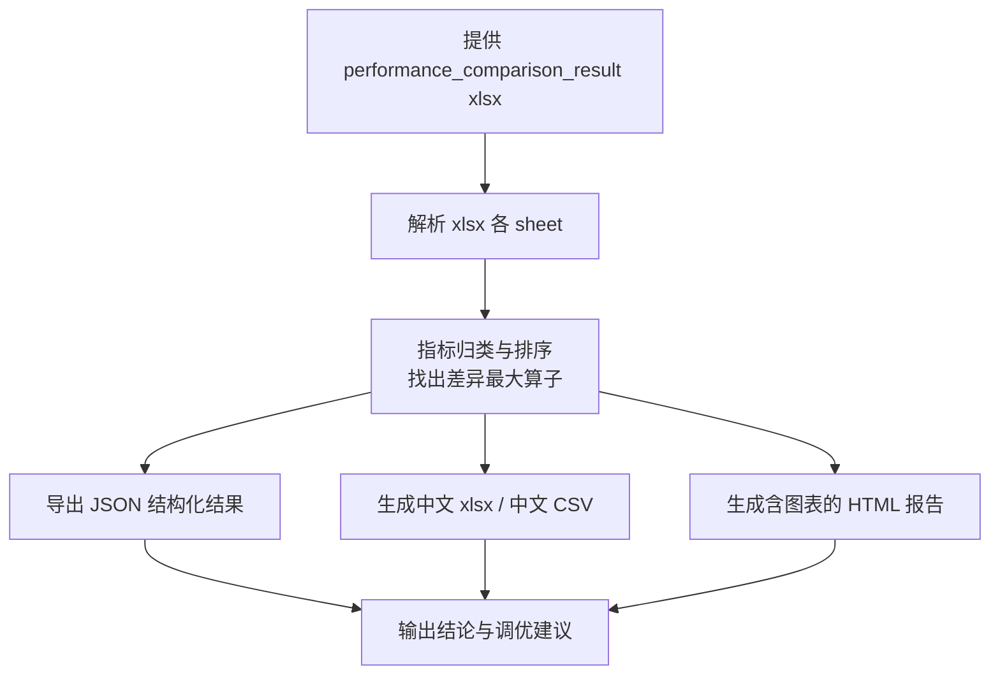

# compare-analyzer（Prof 比对结果解析与报告生成）

解析 `msprof-analyze compare` 生成的性能比对结果 xlsx，自动产出 JSON、HTML 报告、中文 xlsx 与中文 CSV，用于 GPU vs NPU 或 NPU vs NPU 的迁移调优前后对比。

## 应用场景

- 完成迁移/调优后，需要对比两组 Prof 数据（如 GPU 基线 vs NPU 优化后）的算子级性能差异。
- 已用 `msprof-analyze compare` 生成比对 xlsx，需要可读性强的中文报告。
- 需要将比对结论沉淀为 xlsx/CSV 交付给客户或团队。

## 解决什么问题

- 比对 xlsx 为英文表头、多 sheet 结构，直接阅读费时：自动解析并翻译为中文报告。
- 人工挑选重点算子效率低：自动按耗时差异排序，高亮回退/提升最大的算子。
- 交付格式不统一：一次生成 JSON（机器可读）+ HTML（人读报告）+ 中文 xlsx/CSV（表格交付）四种产物。

## 需要什么输入（如何获取）

| 输入 | 说明 | 获取方式 |
|------|------|----------|
| `performance_comparison_result_*.xlsx` | msprof-analyze compare 的比对结果 | 在装有 `msprof-analyze` 的环境执行：`msprof-analyze compare -d1 <基准Prof目录> -d2 <对比Prof目录>`，命令会在当前目录生成 `performance_comparison_result_*.xlsx`；把该 xlsx 路径提供给 skill 即可 |

两个 Prof 数据目录需事先用 msprof 分别采集（训练或推理场景均可）。

## 输出成果

- JSON：结构化比对结果（算子级数据，便于二次处理）。
- HTML 报告：含图表的中文比对报告，标注显著差异项。
- 中文 xlsx：翻译并美化后的比对表格。
- 中文 CSV：轻量表格交付格式。

## 流程图



## 使用样例提示词

```text
# 解析比对结果
使用 compare-analyzer 解析 D:\out\performance_comparison_result_20250801.xlsx，
生成中文 HTML 报告和中文 xlsx

# 前置：先生成比对 xlsx（在 msprof-analyze 环境）
msprof-analyze compare -d1 D:\prof\gpu_baseline -d2 D:\prof\npu_optimized
```
