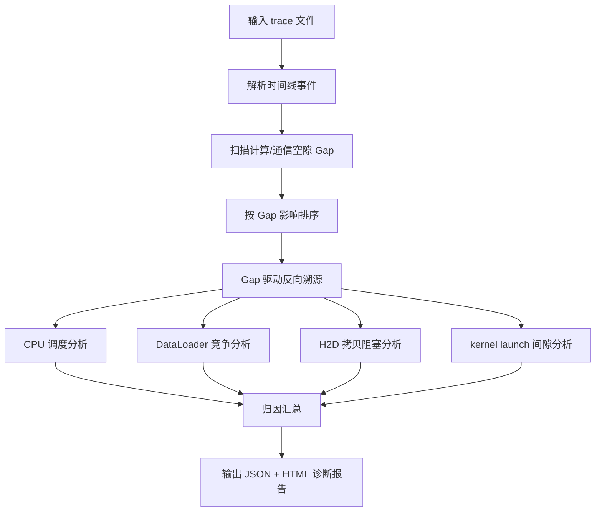

# cpu-trace-analyzer（Host 侧性能瓶颈定位）

分析 CPU trace 数据，以"Gap 驱动反向溯源"方式定位 NPU/GPU 训练场景下的 Host 侧性能瓶颈：CPU 调度问题、DataLoader 竞争、H2D 拷贝阻塞、kernel launch 间隙等。

## 应用场景

- 训练/推理端到端吞吐低于预期，NPU 利用率不高，怀疑 Host 侧拖慢。
- Prof trace 中存在明显时间空隙（Gap），需要归因到具体 Host 侧原因。
- DataPipeline（DataLoader）疑似竞争或阻塞，需要证据定位。
- kernel launch 间隙过大、H2D 拷贝阻塞等细粒度 Host 问题排查。

## 解决什么问题

- trace 文件大、事件密，人工找不到关键空隙：自动扫描 Gap 并按影响排序。
- Gap 出现后不知道"为什么空"：反向溯源到 CPU 调度、DataLoader、H2D 拷贝、kernel launch 等根因类别。
- 结论难沉淀：输出 JSON（机器可读）+ HTML 诊断报告（人读）。

## 需要什么输入（如何获取）

| 输入 | 说明 | 获取方式 |
|------|------|----------|
| trace 文件（.json / .txt / .csv / .trace） | 含 Host 侧事件的时间线数据 | 用 msprof 等工具对训练/推理进程采集 Prof 数据后，取其中的 trace 文件（json/trace 格式）；或使用 perf/perfetto 等导出的时间线文件。将文件路径提供给 skill |

本 skill 内置 `host_trace_diagnosis` Python 分析工程，分析在本机完成，无需上 server。

## 输出成果

- JSON 诊断结果：Gap 列表、归因分类、证据事件（机器可读，便于流水线）。
- HTML 诊断报告：问题清单、时间线摘录、优化建议。

## 流程图



## 使用样例提示词

```text
# 基础诊断
使用 cpu-trace-analyzer 分析 D:\prof\trace_0.json，定位 Host 侧性能瓶颈

# 指定怀疑方向
用 cpu-trace-analyzer 分析 D:\prof\msprof_trace.csv，
重点排查 DataLoader 竞争和 H2D 拷贝阻塞

# Gap 定位
用 cpu-trace-analyzer 检查 D:\prof\host.trace 里 kernel launch 间隙过大的原因
```
