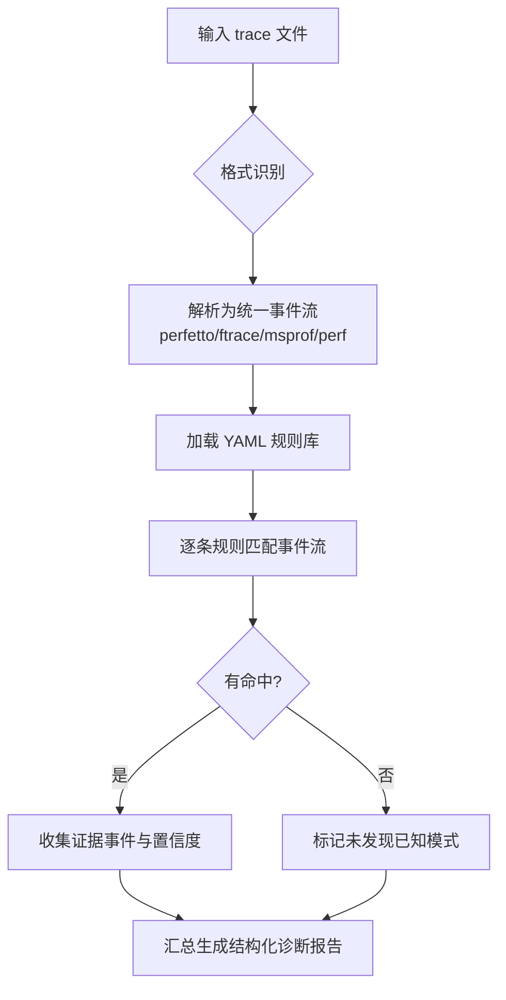

# host-trace-diagnosis（Host 侧 Trace 智能诊断）

对 perfetto / ftrace / msprof / perf 等 Host 侧 trace 进行规则化智能诊断，输出结构化诊断报告。与 cpu-trace-analyzer 同源，侧重"规则库驱动"的逐条匹配诊断。

## 应用场景

- 有 perfetto / ftrace / msprof / perf 采集的 trace 文件，需要系统性健康检查。
- 疑似 Host 侧问题（调度延迟、锁竞争、IO 阻塞、内存回收等）需要按规则逐项过筛。
- 需要可扩展的自定义规则诊断（新增 YAML 规则即可扩展检查项）。

## 解决什么问题

- trace 格式多样（perfetto/ftrace/msprof/perf），人工逐个看耗时：统一解析 + 规则匹配自动诊断。
- 诊断结论不可复现：每条命中结果均关联规则 ID 与证据，便于复核与回归。
- 检查项不可定制：内置 7 个 YAML 规则文件，覆盖常见 Host 侧问题模式，可按需扩展。

## 需要什么输入（如何获取）

| 输入 | 说明 | 获取方式 |
|------|------|----------|
| trace 文件 | perfetto / ftrace / msprof / perf 任一格式 | msprof 采集 Prof 数据后得到 trace；perfetto 可用 `perfetto -o trace.pftrace` 或 record_android_trace 类工具采集；perf 可用 `perf record` + `perf script` 导出。把 trace 文件路径提供给 skill |
| 自定义规则（可选） | YAML 规则文件 | 参考内置 rules 目录格式自行编写，可扩展诊断项 |

## 输出成果

- 结构化诊断报告：命中的问题列表（规则 ID、问题描述、证据事件、置信度）、优化建议。
- 支持与 cpu-trace-analyzer 联动：先定位 Gap，再用规则库逐条诊断。

## 流程图



## 使用样例提示词

```text
# 基础诊断
使用 host-trace-diagnosis 诊断 D:\prof\trace.pftrace

# perf 数据诊断
用 host-trace-diagnosis 分析 D:\prof\perf_script.txt，输出问题列表与建议

# 与 Gap 分析联动
用 cpu-trace-analyzer 找出 D:\prof\trace.json 的 Gap，再用 host-trace-diagnosis 对 Gap 区间做规则诊断
```
