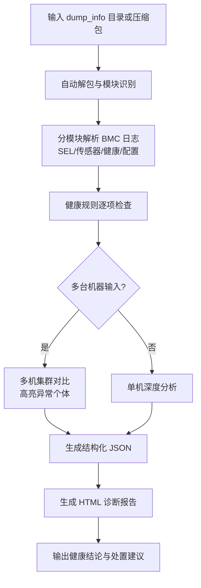

# ibmc_analyzer（华为 iBMC 一键收集日志分析）

分析华为 iBMC 一键收集/带外日志，产出结构化 JSON 与精美 HTML 诊断报告，支持单机深度分析与多机集群对比，快速判断机器/BMC 是否健康。

## 应用场景

- 服务器宕机、重启、告警后，需要从 BMC 侧判断硬件健康状态。
- 批量巡检机房机器：对多台机器的 BMC 日志做集群对比，找出异常个体。
- 处理硬件工单前，用一键收集包快速定性（BMC 异常 / 传感器异常 / 系统事件）。

## 解决什么问题

- BMC 日志模块多（SEL、传感器、健康、配置等）、格式杂：自动解包并分模块解析。
- 人工判断"机器是否健康"缺统一口径：按健康规则逐项检查并汇总结论。
- 多机对比困难：自动横向对比多台机器，高亮异常机器与差异项。
- 交付不便：产出结构化 JSON + 可直接分享的 HTML 诊断报告。

## 需要什么输入（如何获取）

| 输入 | 说明 | 获取方式 |
|------|------|----------|
| `dump_info` 目录 / BMC 日志压缩包 | iBMC 一键收集的完整日志 | 登录 iBMC Web 界面 → 维护诊断 → 一键收集（导出包含 dump_info 的压缩包）；或通过 BMC 命令行的一键收集命令导出。解包后将 `dump_info` 目录路径或压缩包路径提供给 skill |
| 多台机器的收集包（可选） | 集群对比分析所需 | 对每台机器分别执行一键收集并下载，多个路径一起提供 |

触发关键词：BMC 日志、iBMC 日志、一键收集、带外日志、BMC 健康、BMC 对比等。

## 输出成果

- 结构化 JSON：分模块解析结果与健康检查结论（便于二次处理与归档）。
- HTML 诊断报告：单机深度分析（模块级结论、异常事件、风险提示）；多机场景自动生成集群对比报告。

## 流程图



## 使用样例提示词

```text
# 单机分析
使用 ibmc_analyzer 分析 D:\bmc\dump_info 目录，判断机器和 BMC 是否健康

# 压缩包分析
用 ibmc_analyzer 解析 D:\bmc\server01_onekey.zip，生成 HTML 诊断报告

# 多机对比
用 ibmc_analyzer 对比 D:\bmc\node1 与 D:\bmc\node2 两个一键收集包，找出异常机器
```
