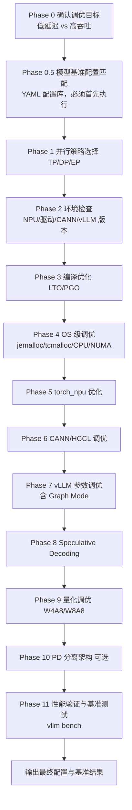

# vllm-ascend-tuning（vLLM-Ascend 性能调优）

vLLM-Ascend 系统级性能调优的完整工作流技能，覆盖从并行策略、编译、OS、框架到模型推理的全链路优化（Phase 0–11），最终输出调优后的启动配置与基准测试结果。

## 应用场景

- 需要提升 vLLM-Ascend 推理速度/吞吐量，或降低延迟（TTFT/TPOT）。
- 询问如何配置最佳性能参数、如何选择并行策略（TP/DP/EP）。
- 推理延迟高或吞吐不足，需要系统性逐层排查优化手段。
- 需要配置 Speculative Decoding（MTP/EAGLE）、量化（W4A8/W8A8）、PD 分离架构。

不适用场景：部署/启动服务、事后 Profiling 分析找瓶颈（应使用对应的其他技能）。

## 解决什么问题

- 调优手段多且散（并行、编译、OS、torch_npu、CANN/HCCL、vLLM 参数、图模式、投机解码、量化），不知从何入手：提供 Phase 0–11 的顺序化工作流，逐步推进。
- 新模型/新硬件没有调优起点：Phase 0.5 从 19 个已验证的 YAML 模型基准配置库中匹配初始配置。
- 每项优化效果无法验证：Phase 11 用 vllm bench 做性能验证与基准测试，量化收益。

## 需要什么输入（如何获取）

| 输入 | 说明 | 获取方式 |
|------|------|----------|
| 模型名称 | 如 Qwen3.5-27B、DeepSeek-V3.2 | 用户直接提供 |
| 硬件信息 | 设备类型（Atlas 800I A2/A3 等）与 NPU 卡数 | 用户根据实际部署环境提供，或在服务器上执行 `npu-smi info` 查看 |
| 量化格式 / 目标场景（可选） | 如 w8a8；低延迟 or 高吞吐 | 用户提供；未提供时按 Phase 0 询问确认 |
| 可访问的 NPU 服务器 | 用于实际调优与基准测试 | 由用户提供 SSH 访问方式或会话内可用的执行环境 |

## 输出成果

- Phase 0.5 匹配的模型基准配置（YAML）与对应启动命令。
- 各 Phase 的调优参数变更清单（环境变量、vLLM 启动参数、OS/CANN 配置）。
- Phase 11 基准测试结果（吞吐/延迟对比）与最终推荐配置。
- 可选的 PD 分离架构配置方案。

## 流程图



## 使用样例提示词

```text
# 完整调优
使用 vllm-ascend-tuning 对 Qwen3.5-27B 在 Atlas 800I A3（8 卡）上进行高吞吐场景调优

# 只要基准配置
用 vllm-ascend-tuning 的 Phase 0.5 为 DeepSeek-V3.2、A3、2 卡、w8a8 找到基准启动配置

# 指定优化方向
用 vllm-ascend-tuning 分析当前 Qwen3.5-122B 服务 TPOT 偏高的问题，
重点检查 Graph Mode 和 Speculative Decoding 配置
```
